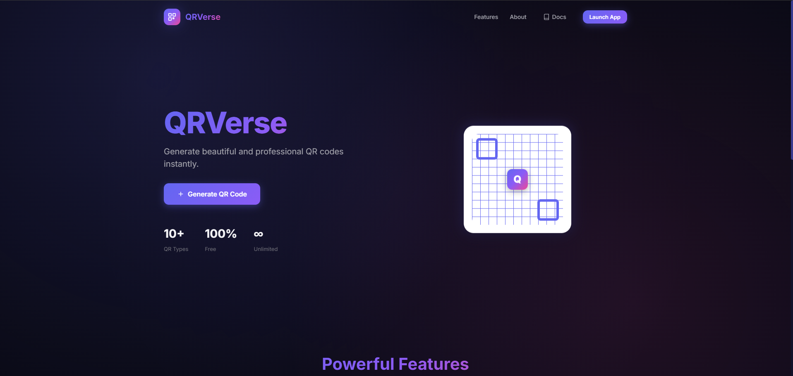
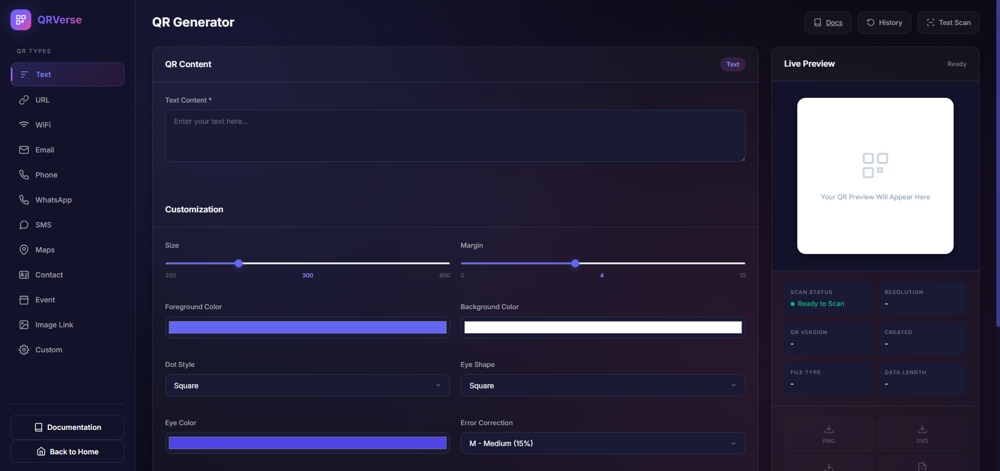
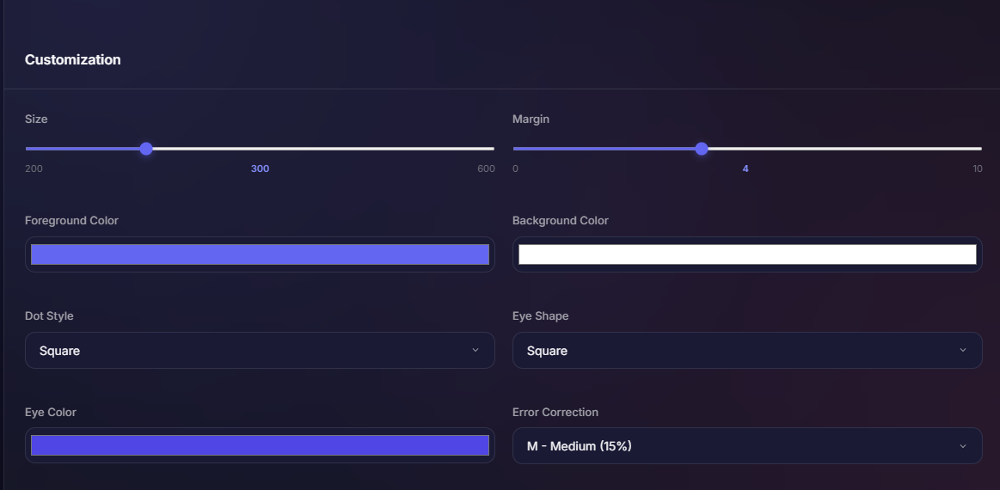
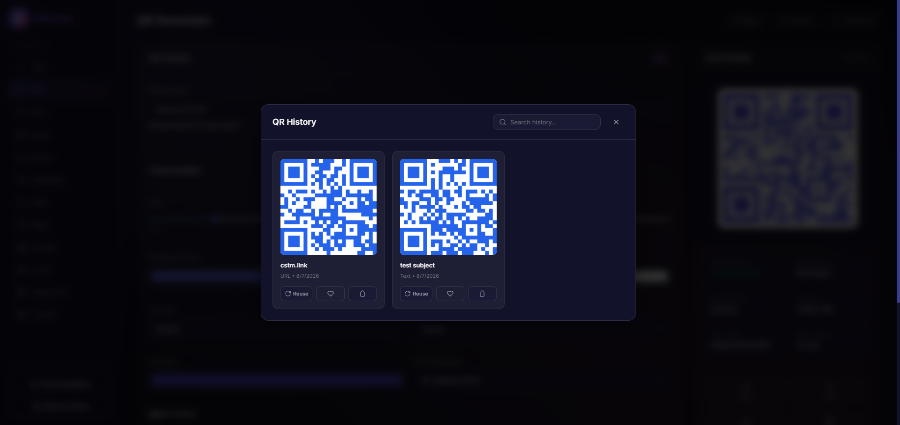

# QRVerse - Professional QR Code Generator

QRVerse is a premium, modern QR code generator built with Node.js, Express.js, HTML5, CSS3, and Vanilla JavaScript. Create beautiful, fully customizable QR codes with a polished SaaS-grade user experience.

## Features

### 🎯 11 QR Types
- **Text** - Simple text content
- **URL** - Website links with validation
- **WiFi** - Network credentials (WPA/WEP/Open)
- **Email** - mailto links with subject & body
- **Phone** - tel: links with country codes
- **WhatsApp** - Direct chat links with pre-filled messages
- **SMS** - Text message links
- **Google Maps** - Location links
- **Contact (vCard)** - Complete contact cards
- **Event** - Calendar events (ICS format)
- **Custom** - Raw data encoding

### 🎨 Full Customization
- QR size control (200-600px)
- Margin adjustment
- Foreground & background colors
- Transparent background option
- Square, rounded, and circle dot styles
- Eye shape styles (square, circle, rounded)
- Eye color customization
- Linear gradient support
- Error correction levels (L/M/Q/H)
- Logo upload (PNG/JPG/SVG) with size control

### 📥 Multiple Export Formats
- PNG download
- SVG download
- JPEG download
- PDF download (A4 with metadata)
- Copy to clipboard
- Print directly
- Share via native share API

### 📡 Live Preview
- Real-time QR generation as you type
- Debounced input handling for performance
- Animated loading spinner
- QR metadata display (resolution, version, created time, file type, data length)

### ✅ Scan Verification
- Webcam QR scanning (html5-qrcode)
- QR image upload & decode
- Success/Failure indicators
- Decoded content display

### 📚 History & Favorites
- Automatic localStorage persistence
- Search history instantly
- Reuse any previous QR
- Favorite/bookmark QR codes
- Delete individual history items

### 🔔 Notifications
- Modern toast notifications for all actions
- Success, error, warning, and info types with auto-dismiss

### 🎨 Design
- Dark mode by default
- Glassmorphism effects
- Rounded corners & soft shadows
- Smooth CSS animations (no libraries)
- Fully responsive (desktop, tablet, mobile)
- Gradient buttons with ripple effects
- Professional typography (Inter font)

### ♿ Accessibility
- Keyboard navigation (Ctrl/Cmd+S generates)
- ARIA labels on all interactive elements
- Proper color contrast
- Focus visible indicators
- Reduced motion support

## Installation

### Prerequisites
- Node.js 14 or higher
- npm (comes with Node.js)

### Setup

```bash
# Clone the repository
git clone https://github.com/yourusername/qrverse.git
cd qrverse

# Install dependencies
npm install

# Start the server
npm start
```

Navigate to `http://localhost:3000` in your browser.

## Usage

### Basic Usage
1. Click **"Launch App"** on the landing page
2. Select a QR type from the left sidebar
3. Fill in the required fields
4. Watch the live preview update instantly
5. Customize colors, styles, and logo as desired
6. Download or share your QR code

### Keyboard Shortcuts
- `Ctrl/Cmd + S` - Generate QR code
- `Esc` - Close any open modal

## Screenshots

**Landing Page**


**Dashboard**


**QR Customization**


**History & Scan**


## Project Structure

```
QRVerse/
├── server.js              # Express server
├── package.json           # Dependencies & scripts
├── README.md              # This file
├── public/
│   ├── index.html         # Single-page application
│   ├── css/
│   │     style.css        # All styles (1400+ lines)
│   ├── js/
│   │     app.js           # All application logic
│   ├── assets/
│   │     logo.png         # Brand logo
│   │     icons/           # UI icons
│   └── downloads/         # Downloaded files
├── routes/
│     qr.js                # QR API routes
└── utils/                 # Utility functions
```

## Dependencies

| Package | Purpose |
|---------|---------|
| [express](https://www.npmjs.com/package/express) | Web server framework |
| [qrcode](https://www.npmjs.com/package/qrcode) | Server-side QR generation |
| [qr-code-styling](https://www.npmjs.com/package/qr-code-styling) | Client-side styled QR rendering |
| [jspdf](https://www.npmjs.com/package/jspdf) | PDF export |
| [html5-qrcode](https://www.npmjs.com/package/html5-qrcode) | Webcam & image QR scanning |

## API Endpoints

### `POST /api/qr/generate`
Generates a QR code server-side.
```json
{
  "data": "https://example.com",
  "options": {
    "errorCorrectionLevel": "M",
    "margin": 4,
    "width": 300,
    "foregroundColor": "#000000",
    "backgroundColor": "#ffffff"
  }
}
```

### `POST /api/qr/validate`
Validates QR data based on type.
```json
{
  "type": "url",
  "data": "https://example.com"
}
```

## Browser Support

- Chrome 60+ (recommended)
- Firefox 60+
- Safari 12+
- Edge 79+

## Performance

- Debounced QR generation (300ms)
- Lazy-loaded history previews
- Optimized DOM updates
- No unnecessary re-renders
- Minimal external dependencies

## License

MIT License

Copyright (c) 2026 QRVerse

Permission is hereby granted, free of charge, to any person obtaining a copy
of this software and associated documentation files (the "Software"), to deal
in the Software without restriction, including without limitation the rights
to use, copy, modify, merge, publish, distribute, sublicense, and/or sell
copies of the Software, and to permit persons to whom the Software is
furnished to do so, subject to the following conditions:

The above copyright notice and this permission notice shall be included in all
copies or substantial portions of the Software.

THE SOFTWARE IS PROVIDED "AS IS", WITHOUT WARRANTY OF ANY KIND, EXPRESS OR
IMPLIED, INCLUDING BUT NOT LIMITED TO THE WARRANTIES OF MERCHANTABILITY,
FITNESS FOR A PARTICULAR PURPOSE AND NONINFRINGEMENT. IN NO EVENT SHALL THE
AUTHORS OR COPYRIGHT HOLDERS BE LIABLE FOR ANY CLAIM, DAMAGES OR OTHER
LIABILITY, WHETHER IN AN ACTION OF CONTRACT, TORT OR OTHERWISE, ARISING FROM,
OUT OF OR IN CONNECTION WITH THE SOFTWARE OR THE USE OR OTHER DEALINGS IN THE
SOFTWARE.